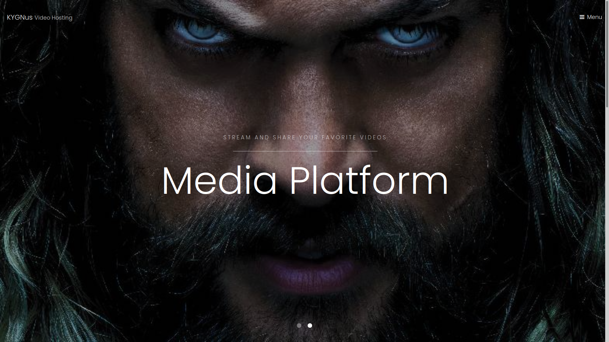
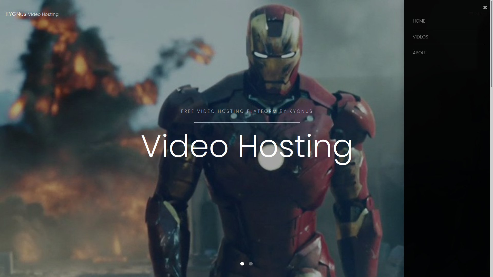

# CASTBOX - Free Video Hosting 






## Overview
This project is part of an initiative to **prevent electronic waste** by repurposing old servers and computers. By converting your old devices into functional video hosting servers, you can contribute to sustainability while creating a useful tool for your personal or organizational video storage needs.

The application serves as a simple **video hosting server**, where users can store and stream videos from old hardware. The server is built using **Flask** (a lightweight Python web framework), and it hosts videos stored in a specific directory on your Linux machine.

## Features
- Serve videos from any folder on your Linux machine.
- Web interface to list videos and stream them in a browser.
- Responsive design using **Bootstrap 5**.
- Modal video player for smooth viewing experience.
- Open source and free to use.

## Technology Stack
- **Backend**: Python with **Flask**
- **Frontend**: HTML, CSS, JavaScript with **Bootstrap 5**
- **Operating System**: **Linux** (e.g., Ubuntu)
- **Video Hosting**: Serve videos from your own file system

## Project Structure
```
/project-folder
    /templates
        index.html
    /static
        /assets
    app/main.py
```

## Installation

### 1. Clone the Repository

First, clone the repository to your local machine:
```bash
git clone https://github.com/KooshaYeganeh/FMhost.git
```

```
python3.11 -m venv venv
source venv/bin/activate
```

### 2. Install Dependencies

Make sure you have **Python 3** and **pip** installed on your system. Install the required Python packages:

```bash
pip install -r requirements.txt
```

### 3. Run the Flask App

Once the dependencies are installed, you can run the Flask app:

```bash
cd app && gunicorn -w 3 -b 127.0.0.1:5005 main:app
```

The server will start at `http://127.0.0.1:5005`. You can now access your video hosting server through your browser.

### 4. Customize Video Directory

Modify the `SHAREFOLDER` variable in `config.py` to point to your desired directory where the videos are stored. For example:
```python
SHAREFOLDER = "/home/koosha/Videos/Hosting"
```

## License

This project is licensed under the **MIT License** - see the [LICENSE](LICENSE) file for details.

## Acknowledgments
- [Flask](https://flask.palletsprojects.com/) - The web framework used to build this project.
- [Bootstrap](https://getbootstrap.com/) - For the responsive and modern UI design.
- [FFmpeg](https://ffmpeg.org/) - For video processing (optional for thumbnail generation).
- **FSFE (Free Software Foundation Europe)**: Supporting **Free Software** and open-source projects.


## Support

If you need help with this project or have any questions, feel free to open an issue in the repository or contact the project maintainer.

---

Thank you for contributing to a more sustainable future by reducing electronic waste! 🌍♻️


